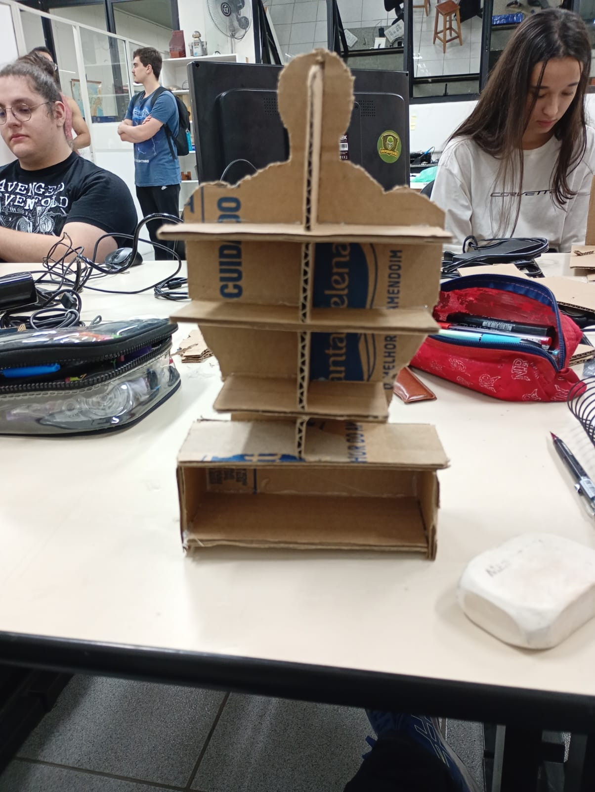
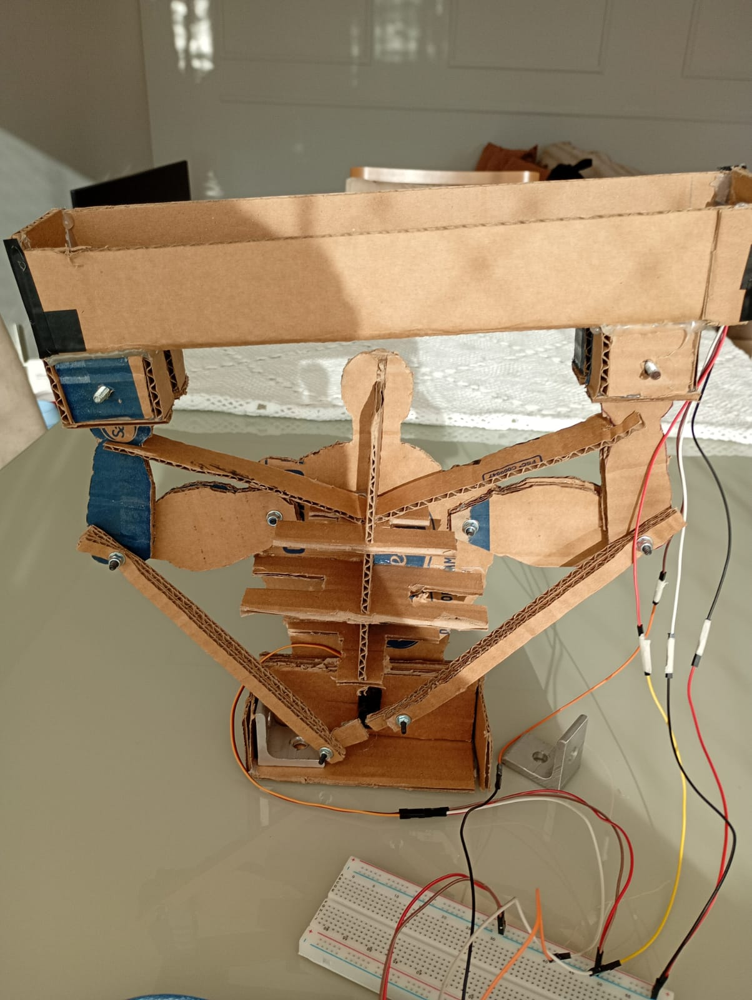
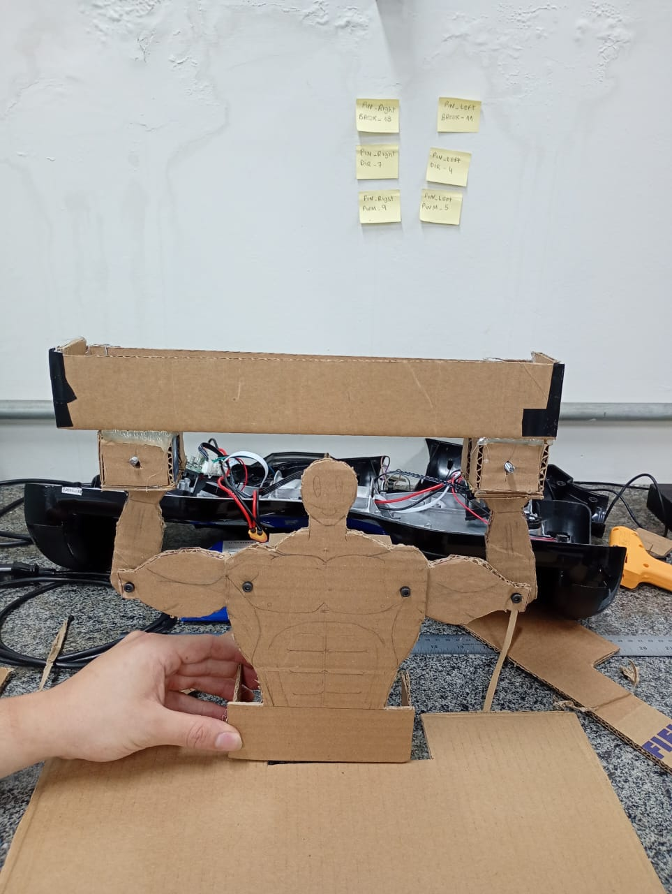
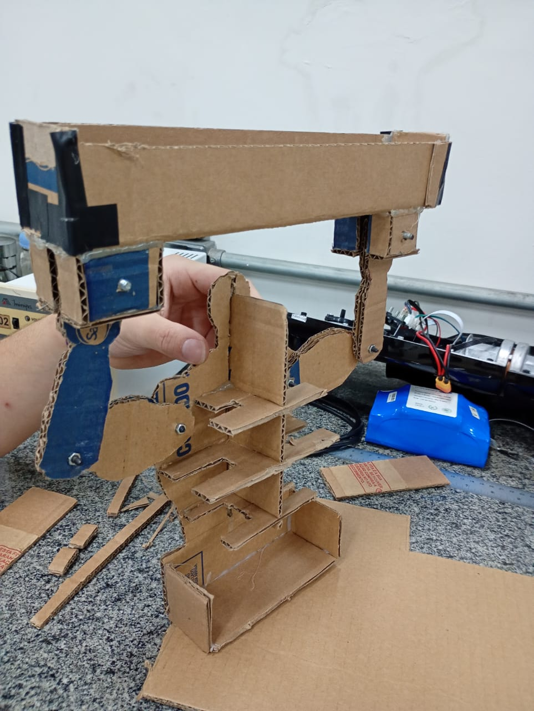
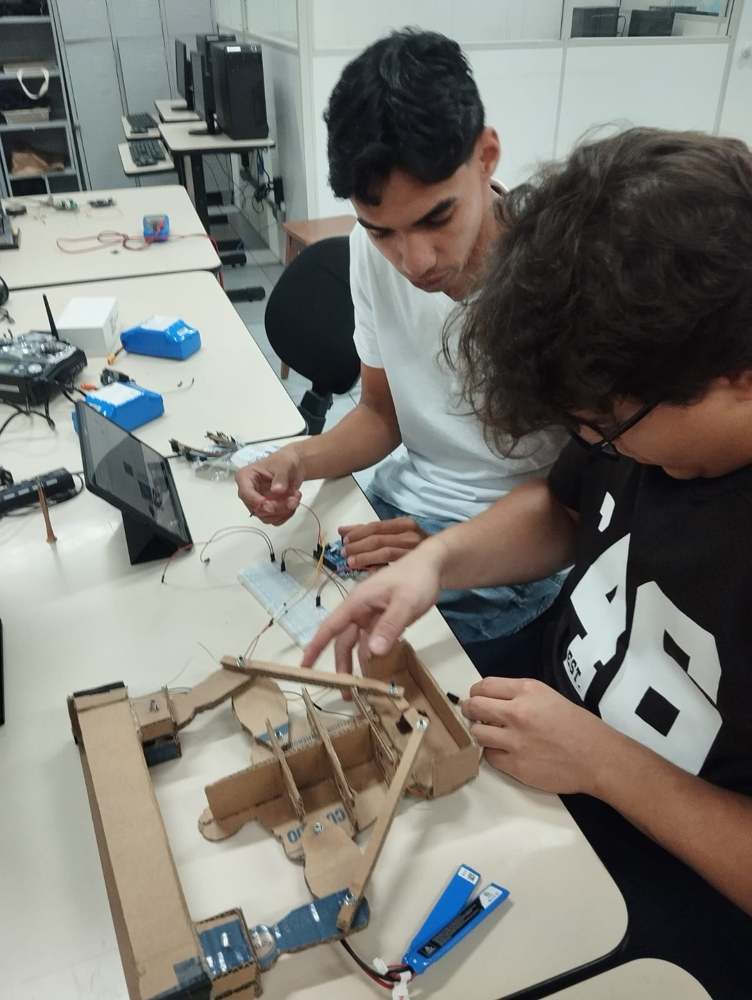
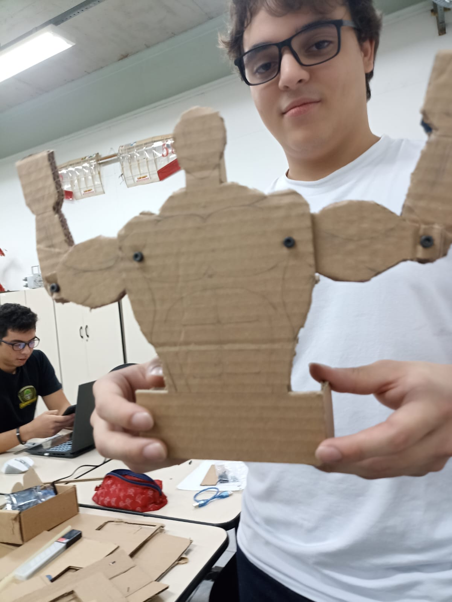
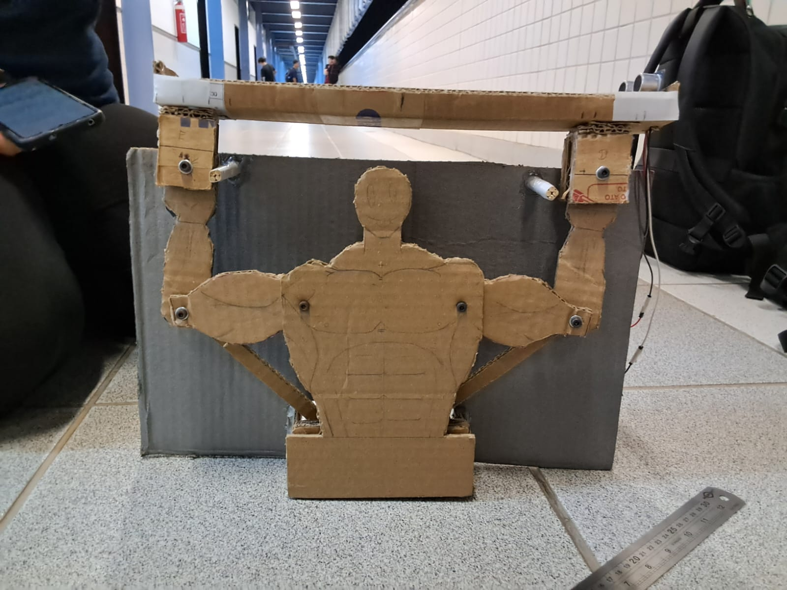
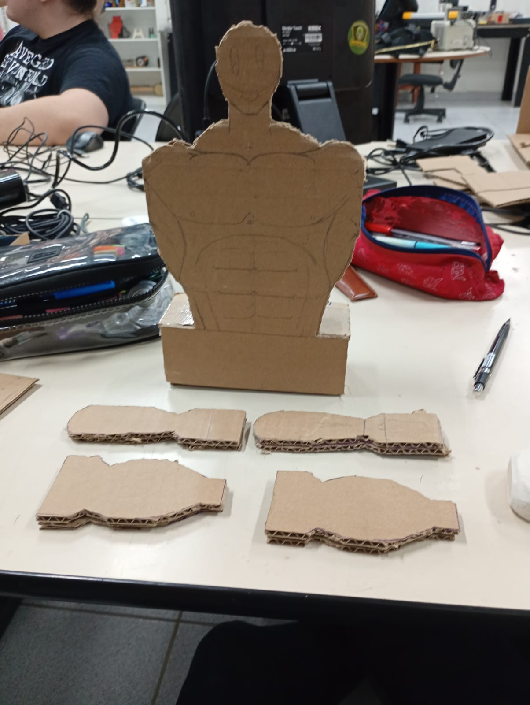

# -SISTEMA-BALL-AND-BEAM-
A presente atividade tem por objeto o desenvolvimento de um sistema Ball and Beam, utilizado como instrumento didático para aplicação prática de conceitos fundamentais de robótica, controle e integração eletromecânica.

## 🎥 Vídeo do funcionamento

[▶️ Ver o carrinho seguindo a linha] https://youtube.com/shorts/5My7dQN6xVg?si=4XTwxCRSOLtU6x11

## 📸 Imagens do sistema Ball and Beam

